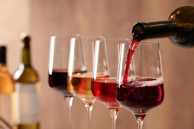

# Predict Wine Quality notebook

## What is the notebook about?
There are numerous factors that effect the quality of wine such as the grape, climate, the ageing process and equipments, and yeast, all of which contribute to the chemical composition of the wine. In this notebook, the wine data which accounts for 15% of the total Portuguese production is analysed to predict the quality using Multiple Linear Regression.

## What algorithms are used?
* Multiple Linear Regression is used to predict the quality of wine.

## What is the content of the notebook?
The notebook performs Exploratory Data Analysis (EDA) and then training of a Multiple Linear Regression model with the features. Finally, the model is evaluated with the R-Squared test and the predicted result is plotted against the true results, to visualise the deviation.

